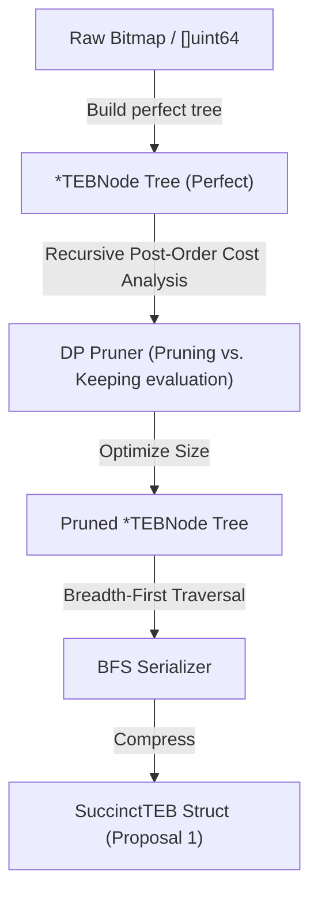

# Tree-Encoded Bitmaps (TEB) in Go: Design Proposals

This document details three distinct architectural proposals for implementing **Tree-Encoded Bitmaps (TEBs)** in Go, based on the paper *"Tree-Encoded Bitmaps"* (SIGMOD '20). 

---

## Technical Core Concepts & Mathematical Formulation

To build a high-performance TEB in Go, we must translate the paper's succinct level-order binary marked representation into idiomatic, hardware-friendly Go. 

### 1. BFS Bit Vector Navigation
The pruned tree structure $T$ is stored in a single bit vector. An inner node is represented by a `1` bit, and a leaf node by a `0` bit. Using a **0-indexed** position $i$ in $T$, the navigation formulas are:
*   $\text{left-child}(i) = 2 \cdot \text{rank}(i) - 1$
*   $\text{right-child}(i) = 2 \cdot \text{rank}(i)$

Where $\text{rank}(i)$ is the **inclusive** count of `1` bits in $T[0 \dots i]$. 

For leaf node $i$ (where $T[i] == 0$), its label is located in the label bit vector $L$ at the index:
$$\text{label-index}(i) = i - \text{rank}(i)$$

### 2. Rank Lookup Table (LuT)
Computing the rank bit-by-bit is $O(N)$. To achieve $O(1)$ rank calculations, we implement a Rank Lookup Table (LuT) with 512-bit block granularity:
$$\text{rank}(i) = \text{LUT}[\lfloor i/512 \rfloor] + \text{popcount}(T[\lfloor i/512 \rfloor \cdot 512 \dots i])$$
Go's `math/bits.OnesCount64` compiles down to the native assembly `POPCNT` instruction on modern CPU architectures, allowing us to perform the intra-block population count extremely rapidly.

---

## Design Proposal 1: Succinct Flat TEB (Read-Optimized & Immutable)

This proposal implements the canonical, memory-efficient, static representation of TEBs. It is designed for maximum query speed, minimal memory footprint, and read-heavy workloads (such as analytical databases and search indexes).

```mermaid
graph TD
    subgraph SuccinctTEB Memory Layout
        T["T []uint64 (Tree Structure Bits)"] 
        RankLUT["RankLUT []uint32 (512-bit Block Offsets)"]
        L["L []uint64 (Leaf Labels Bits)"]
    end
    T -->|i| RankFunc["Rank(i)"]
    RankLUT -->|LUT[i/512]| RankFunc
    RankFunc -->|Inclusive Rank| LeftFormula["left-child(i) = 2*rank - 1"]
    RankFunc -->|Inclusive Rank| RightFormula["right-child(i) = 2*rank"]
    RankFunc -->|Leaf Label Index| LabelFormula["label(i) = L[i - rank]"]
```

### Go Implementation Sketch

```go
package teb

import (
	"math/bits"
)

// SuccinctTEB represents a highly-compressed, read-only tree-encoded bitmap.
type SuccinctTEB struct {
	length             int      // Original length of the bitmap (in bits)
	treeHeight         int      // Height of the binary tree
	perfectLevels      int      // Number of implicit/perfect levels (u)
	implicitInnerNodes uint32   // Count of implicit inner nodes (c)
	leadingZeroLabels  uint32   // Count of skipped leading 0-labels
	explicitLabels     uint32   // Count of explicit labels stored in L
	t                  []uint64 // Encoded tree structure T
	rankLUT            []uint32 // Precomputed rank values on 512-bit blocks
	l                  []uint64 // Encoded leaf labels L
}

// GetBit performs a point lookup for the k-th bit.
func (teb *SuccinctTEB) GetBit(k int) bool {
	if k < 0 || k >= teb.length {
		return false
	}

	// 1. Skip perfect levels: jump directly to the target node at the last perfect level.
	tOffset := uint32(k >> uint(teb.treeHeight-teb.perfectLevels-1))
	tBegin := uint32((1 << uint(teb.perfectLevels-1)) - 1)
	tEnd := uint32((1 << uint(teb.perfectLevels)) - 1)
	
	i := tBegin + tOffset
	j := teb.treeHeight - 1 - teb.perfectLevels - 1

	// 2. Navigate downwards until a leaf node is encountered.
	for teb.isInnerNode(i) {
		// Extract the j-th bit from k to determine path direction (0 for Left, 1 for Right).
		direction := uint32((k >> uint(j)) & 1)
		i = teb.leftChild(i) + direction
		j--
	}

	// 3. Return the label associated with the leaf node.
	return teb.label(i)
}

// rank calculates the inclusive rank (number of 1s in T[0..i])
func (teb *SuccinctTEB) rank(i uint32) uint32 {
	block := i / 512
	bitOffset := i % 512

	r := teb.rankLUT[block]
	wordStart := block * 8 // 8 uint64s per 512-bit block

	// Popcount whole uint64 words up to the target index
	fullWords := bitOffset / 64
	for w := uint32(0); w < fullWords; w++ {
		r += uint32(bits.OnesCount64(teb.t[wordStart+w]))
	}

	// Popcount remaining bits in the current word
	remainingBits := bitOffset % 64
	if remainingBits > 0 {
		mask := ^uint64(0) >> (64 - remainingBits)
		r += uint32(bits.OnesCount64(teb.t[wordStart+fullWords] & mask))
	}

	return r
}

func (teb *SuccinctTEB) isInnerNode(i uint32) bool {
	word := i / 64
	bit := i % 64
	return (teb.t[word] & (1 << bit)) != 0
}

func (teb *SuccinctTEB) leftChild(i uint32) uint32 {
	return 2*teb.rank(i) - 1
}

func (teb *SuccinctTEB) rightChild(i uint32) uint32 {
	return 2 * teb.rank(i)
}

func (teb *SuccinctTEB) label(i uint32) bool {
	fullIndex := i - teb.rank(i)
	
	// Adjust for omitted leading/trailing 0-labels
	if fullIndex < teb.leadingZeroLabels {
		return false
	}
	if fullIndex >= teb.leadingZeroLabels+teb.explicitLabels {
		return false
	}

	relativeIdx := fullIndex - teb.leadingZeroLabels
	word := relativeIdx / 64
	bit := relativeIdx % 64
	return (teb.l[word] & (1 << bit)) != 0
}
```

### Trade-offs
*   **Pros**: Incredible space savings (up to 34% over Roaring on sorted datasets); rapid cache-friendly random access; zero heap allocations during lookups.
*   **Cons**: Completely immutable. Any modification (bit flip) requires a full rebuild of the succinct structures.

---

## Design Proposal 2: Pointer-Based Tree Builder (Mutable & DP-Pruning)

Since the succinct flat representation is static, we need a mutable, dynamic representation for the construction and optimization phases. This proposal provides an intuitive dynamic tree builder that implements the bottom-up pruning and size-optimization logic in Go.

Notably, the paper points out that **fully pruning** the tree does not always yield the smallest physical representation due to the implicit-nodes optimization. The builder utilizes recursive cost analysis to prune only when it reduces physical size.



### Go Implementation Sketch

```go
package teb

// TEBNode represents a mutable tree node during the construction/pruning phase.
type TEBNode struct {
	Left   *TEBNode
	Right  *TEBNode
	Label  bool
	IsLeaf bool
}

// TEBBuilder manages the dynamic construction of a TEB.
type TEBBuilder struct {
	length int
	root   *TEBNode
}

func NewTEBBuilder(length int) *TEBBuilder {
	return &TEBBuilder{
		length: length,
		root:   &TEBNode{IsLeaf: true, Label: false},
	}
}

// Insert sets a bit at offset k.
func (b *TEBBuilder) Insert(k int) {
	b.root = insertRecursive(b.root, k, 0, b.length)
}

func insertRecursive(node *TEBNode, k int, currentDepth, totalLength int) *TEBNode {
	if node == nil {
		node = &TEBNode{IsLeaf: true, Label: false}
	}
	
	// If it's a leaf node but we need to go deeper, split it.
	if node.IsLeaf && (1<<uint(currentDepth)) < totalLength {
		node.IsLeaf = false
		node.Left = &TEBNode{IsLeaf: true, Label: node.Label}
		node.Right = &TEBNode{IsLeaf: true, Label: node.Label}
	}

	if node.IsLeaf {
		node.Label = true
		return node
	}

	mid := totalLength / 2
	if k < mid {
		node.Left = insertRecursive(node.Left, k, currentDepth+1, mid)
	} else {
		node.Right = insertRecursive(node.Right, k - mid, currentDepth+1, totalLength - mid)
	}
	return node
}

// PruneOptimized performs cost-optimized bottom-up pruning using a simple 
// recursive cost model (DP).
func (b *TEBBuilder) PruneOptimized() {
	b.root.pruneCostRecursive()
}

// pruneCostRecursive returns (pruned, cost)
// Cost is represented as a structural score:
// - Explicit Leaf: 1 label bit + 1 tree bit = 2 units
// - Explicit Inner Node: 1 tree bit = 1 unit
func (n *TEBNode) pruneCostRecursive() (bool, int) {
	if n.IsLeaf {
		return true, 2 // 1 label bit + 1 tree structure bit (if explicit)
	}

	leftPruned, leftCost := n.Left.pruneCostRecursive()
	rightPruned, rightCost := n.Right.pruneCostRecursive()

	// If children can be pruned, evaluate if identical labels exist.
	if leftPruned && rightPruned && n.Left.Label == n.Right.Label {
		prunedCost := 2 // If we merge them, the parent becomes a leaf (cost = 2)
		keepCost := leftCost + rightCost + 1 // Keep children + parent's structural bit

		if prunedCost <= keepCost {
			n.IsLeaf = true
			n.Label = n.Left.Label
			n.Left = nil
			n.Right = nil
			return true, prunedCost
		}
	}

	return false, leftCost + rightCost + 1
}
```

### Trade-offs
*   **Pros**: Easy-to-understand pointer-based mutations; elegant post-order recursion for custom optimization models; serves as a robust "Builder" pattern.
*   **Cons**: Significant memory allocation overhead due to millions of node pointers; high garbage collection pressure for massive bitmaps.

---

## Design Proposal 3: Partitioned Container-Based TEB (Production-Grade Hybrid)

To build a production-grade bitmap index like **Roaring Bitmaps**, we cannot rely solely on a single global tree. Global trees become too deep and suffer from high update costs. 

This design divides the bitmap into logical partitions of $2^{16}$ (65,536) bits. Each partition is represented by the most space-efficient container. This introduces the `TEBContainer` alongside Roaring's traditional Array and Bitmap containers, achieving fast dynamic updates while leveraging TEB's dense compression superiority.

```mermaid
graph TD
    Bitmap["Global Bitmap (e.g., 1,000,000 bits)"] -->|Split into 64KB blocks| Index["Index Entry Array (Keys + Containers)"]
    Index -->|Block 0 [Sparse]| C1["ArrayContainer (Sorted []uint16)"]
    Index -->|Block 1 [Dense / Clustered]| C2["TEBContainer (Local TEB, Height=16)"]
    Index -->|Block 2 [Fully Populated]| C3["BitmapContainer ([]uint64)"]
```

### Go Implementation Sketch

```go
package teb

// Container defines the interface for local partition segments.
type Container interface {
	Get(val uint16) bool
	Insert(val uint16) Container
	Iterator() RunIterator
	Type() string
}

// HybridBitmap manages partition blocks of 65,536 bits.
type HybridBitmap struct {
	keys       []uint16    // 16-bit key prefix representing the block (index)
	containers []Container // Specific container types (Array, Bitmap, TEB)
}

// TEBContainer implements a local, height-16 succinct TEB.
type TEBContainer struct {
	// A height-16 TEB has a maximum of 65,536 leaf nodes.
	// We can use uint16 instead of uint32 for indexing, halving pointer/metadata sizes.
	perfectLevels uint8
	t             []uint16 // Optimized tree structure
	l             []uint16 // Optimized leaf labels
	rankLUT       []uint16 // Smaller 128-bit block LuT (highly cache friendly)
}

func (c *TEBContainer) Get(val uint16) bool {
	// Perform local TEB lookup
	return c.lookupLocal(val)
}

func (c *TEBContainer) Insert(val uint16) Container {
	// To update:
	// 1. Decompress local TEB back to a fast temporary bitmap (65,536 bits = 8KB)
	// 2. Set the bit in the temporary bitmap
	// 3. Re-evaluate best container type (Array, Bitmap, or TEB)
	// 4. Re-compress and return the new container
	return c
}

func (c *TEBContainer) Type() string { return "TEB" }

// Stack-allocated Iterator for Height-16 TEB Containers
type LocalTEBIterator struct {
	container *TEBContainer
	// For height-16, the traversal stack has a maximum depth of 16.
	// This pre-allocated stack avoids heap allocations entirely in Go!
	stack      [16]stackFrame 
	stackDepth int
}

type stackFrame struct {
	nodeIndex uint16
	path      uint16
}
```

### Trade-offs
*   **Pros**: 
    1.  **Updatability**: Updates are bounded to a single 65,536-bit partition.
    2.  **No Heap Allocations**: Iteration stack size is fixed at `16` frames. We can allocate the iterator's stack on Go's thread-local execution stack rather than the heap.
    3.  **Adaptive Compression**: Seamlessly upgrades/downgrades containers depending on bit density.
*   **Cons**: Added complexity of managing container transitions and merging different container types during bitwise operations (`AND`/`OR`).

---

## Performance-Critical Operations in Go

### 1. Vectorized Tree Scan Iterator (`math/bits`)
The paper details an AVX-512 SIMD scanner for parallel scans of tree levels. Since Go does not natively compile standard loops into advanced AVX-512 instructions without CGO or manual assembler, we can write a highly efficient, CPU-independent bitwise pipeline in pure Go using `math/bits.TrailingZeros64` for stackless traversals:

```go
// Forward iterates the run iterator in O(log N) using CPU-intrinsic TZCOUNT.
func (it *RunIterator) Forward() {
	for it.tOffset < it.tEnd {
		for it.stackDepth > 0 {
			frame := it.pop()
			i, p := frame.nodeIndex, frame.path

			for it.teb.isInnerNode(i) {
				left := it.teb.leftChild(i)
				p = p << 1
				it.push(left+1, p|1) // Push right child to stack
				i = left
			}

			// Leaf node reached
			if it.teb.label(i) {
				// 1-run discovered! Calculate bounds.
				level := bits.Len64(uint64(p)) - 1
				it.CurrentBegin = (p ^ (1 << level)) << (it.teb.treeHeight - level)
				it.CurrentEnd = it.CurrentBegin + (it.teb.length >> level)
				return
			}
		}
		
		// Move to next root in the perfect level
		it.tOffset++
		p := it.tOffset - it.tBegin | (1 << (it.teb.perfectLevels - 1))
		it.push(it.tOffset, p)
	}
	it.CurrentBegin = it.teb.length
	it.CurrentEnd = it.teb.length
}
```

### 2. Fast Intersections (`AND` Iterator)
Bitwise operations are implemented on top of the 1-run iterators. An intersection evaluates overlaps between 1-runs. If runs do not overlap, the iterator uses `SkipTo()` to jump forward in logarithmic time.

```go
type ANDIterator struct {
	a, b       *RunIterator
	Start, End int
}

func (and *ANDIterator) Next() bool {
	for and.a.CurrentBegin < and.a.teb.length && and.b.CurrentBegin < and.b.teb.length {
		beginMax := max(and.a.CurrentBegin, and.b.CurrentBegin)
		endMin := min(and.a.CurrentEnd, and.b.CurrentEnd)

		if beginMax < endMin { // Overlap found
			and.Start = beginMax
			and.End = endMin
			
			if and.a.CurrentEnd <= and.b.CurrentEnd {
				and.a.Forward()
			}
			if and.b.CurrentEnd <= and.a.CurrentEnd {
				and.b.Forward()
			}
			return true
		}
		
		// Fast-forward the lagging iterator to the other's start position in O(log N)
		if and.a.CurrentEnd <= and.b.CurrentEnd {
			and.a.SkipTo(and.b.CurrentBegin)
		} else {
			and.b.SkipTo(and.a.CurrentBegin)
		}
	}
	return false
}
```
